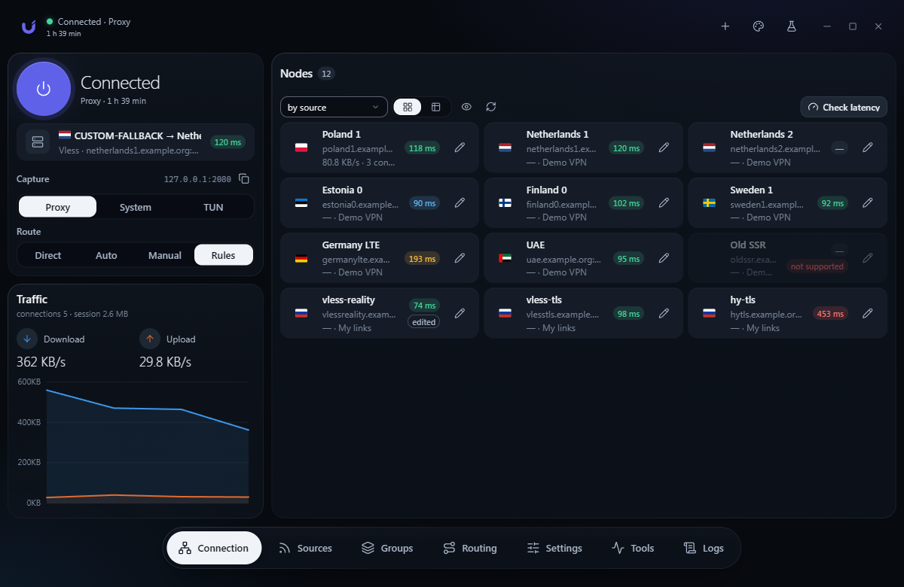
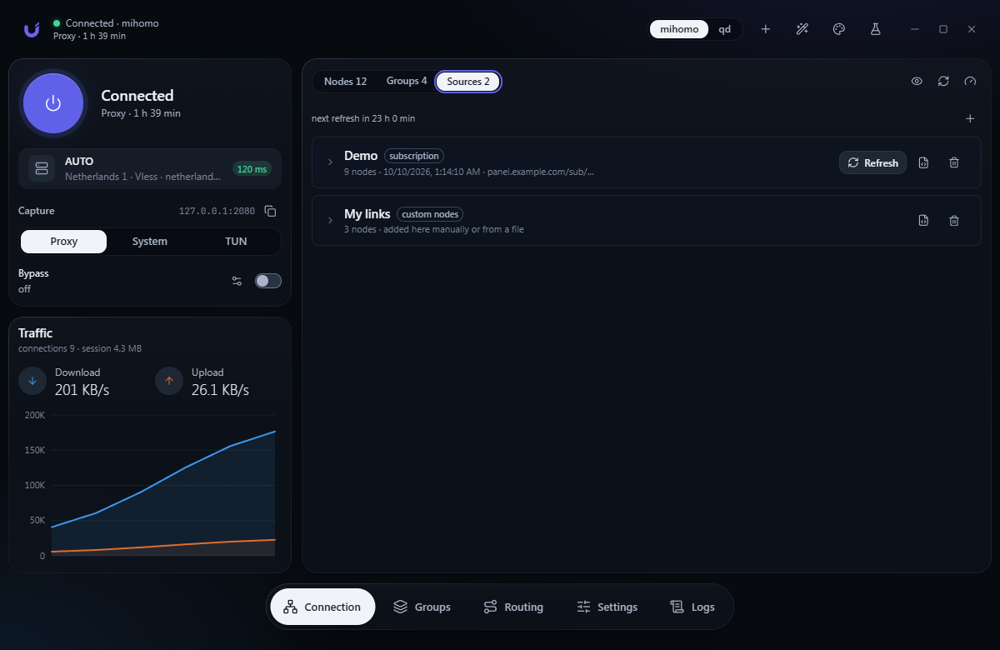
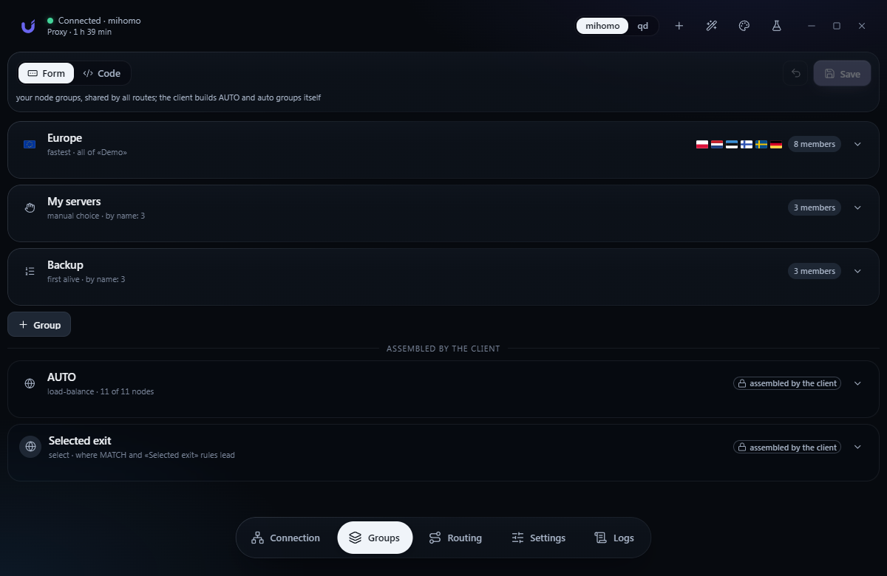
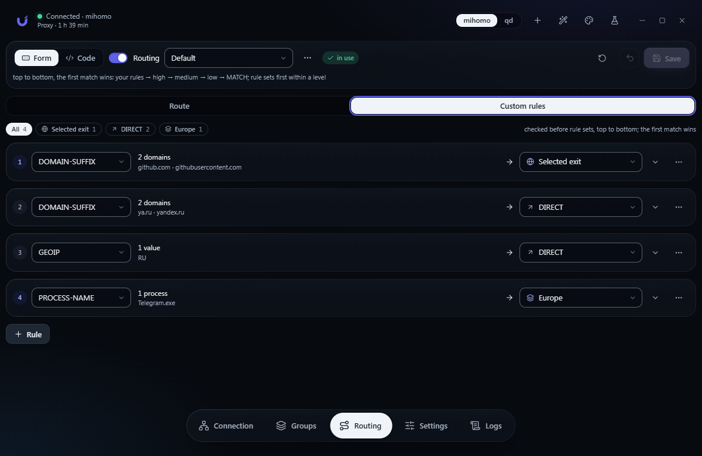
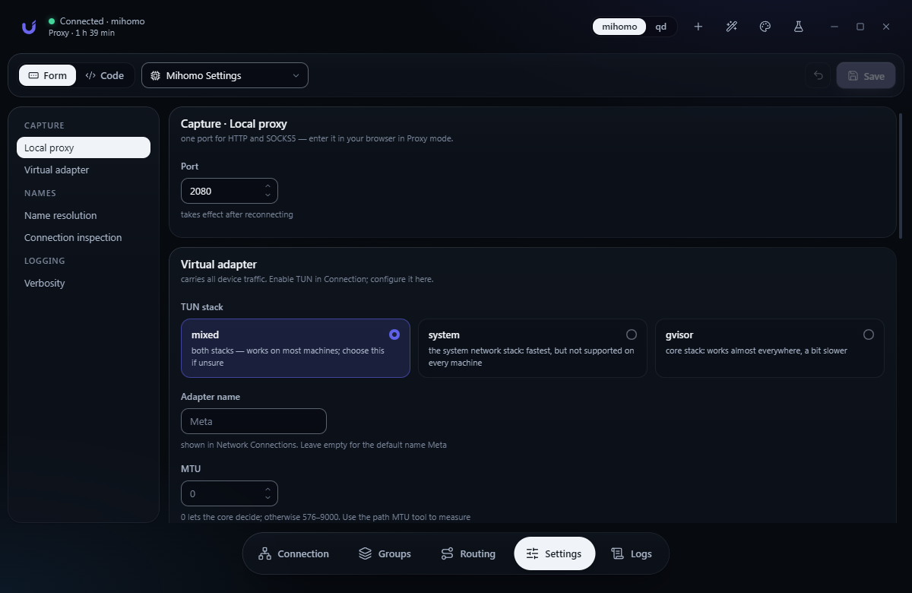
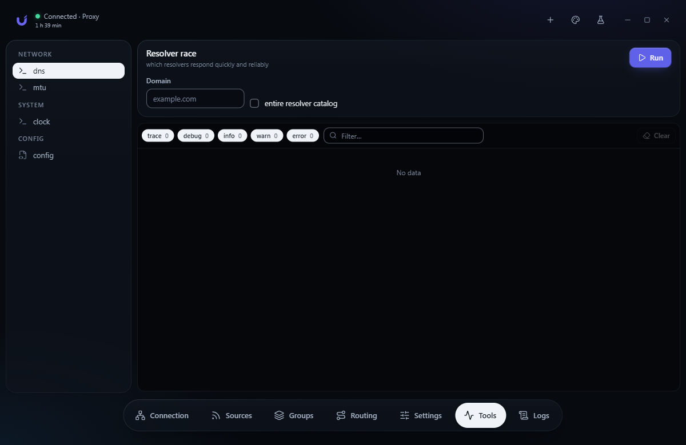
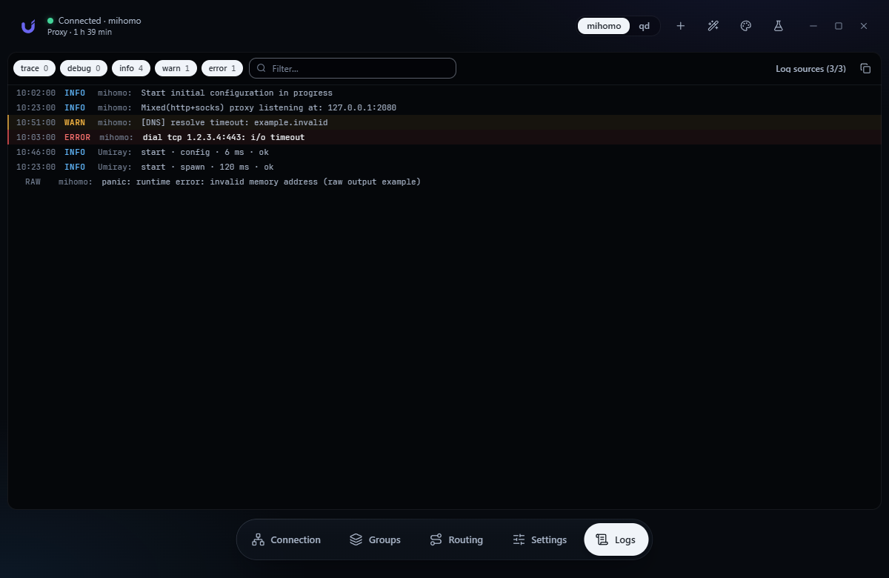

<p align="center">
  
</p>

<h1 align="center">Umiray</h1>

<p align="center">
  A Windows VPN client powered by <a href="https://github.com/MetaCubeX/mihomo">Mihomo</a>.<br>
  Tauri&nbsp;2 · Rust · React · <a href="https://github.com/rityak/rootik">Rootik</a>
</p>

<p align="center"><b>1.3.1</b> · <a href="README.ru.md">Русская версия</a></p>



## Features

- One-click connection with separate Proxy, System and TUN modes.
- Direct, Auto and Manual routing, or your own rules.
- Subscriptions, individual links, WireGuard and AmneziaWG files, and custom nodes.
  Node edits survive subscription refreshes.
- Groups and routing rules editable as forms or YAML, with presets and rollback.
- DNS, MTU, clock, leak and speed diagnostics.
- Kill-switch, autostart and scheduled administrator launch.
- Privacy mode hides server addresses and subscription names for screenshots and streams.
- Signed client updates from GitHub Releases, with confirmation and download progress.

## Screenshots

| | |
|---|---|
|  |  |
|  |  |
|  |  |

Screenshots use demo data.

## Getting started

Download the Windows x64 `*-setup.exe` from [Releases](https://github.com/rityak/umiray/releases/latest) and install it.
The client downloads mihomo from its official release page on first launch.

TUN requires administrator rights. The client can create a scheduled task to launch
with those rights without asking for UAC confirmation each time.

Data is stored in `%LOCALAPPDATA%\umiray`.

The interface selects Russian when a Russian keyboard layout is installed; otherwise,
it selects English. Override this in Settings → Umiray Settings → Interface language.

## Build

Requires Node.js 22+, Rust and the [Tauri prerequisites](https://v2.tauri.app/start/prerequisites/).

```
npm ci
npm run tauri dev
npm run tauri build -- --no-bundle
```

The executable is `src-tauri/target/release/umiray.exe`.

Checks: `npm run lint`, `npm test`, `npx tsc --noEmit`, and `cargo test` in `src-tauri`.

`npm run dev` opens the interface in a browser with demo data.

## Status

Version 1.0 for Windows x64. Report bugs in [Issues](https://github.com/rityak/umiray/issues).

Updates are checked on launch and in Settings → Umiray Settings → Maintenance.
Installation verifies the signature, disconnects VPN and preserves user data.

Maintainers: [publishing a release](RELEASING.md).
